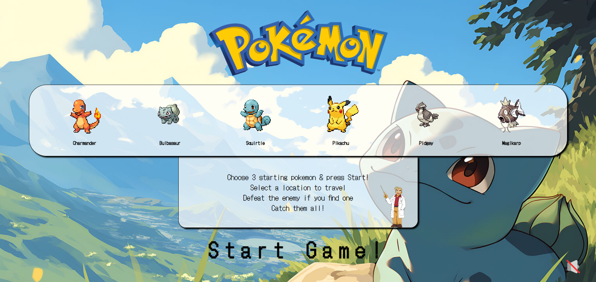
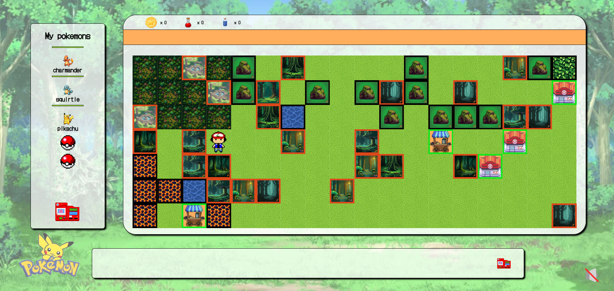
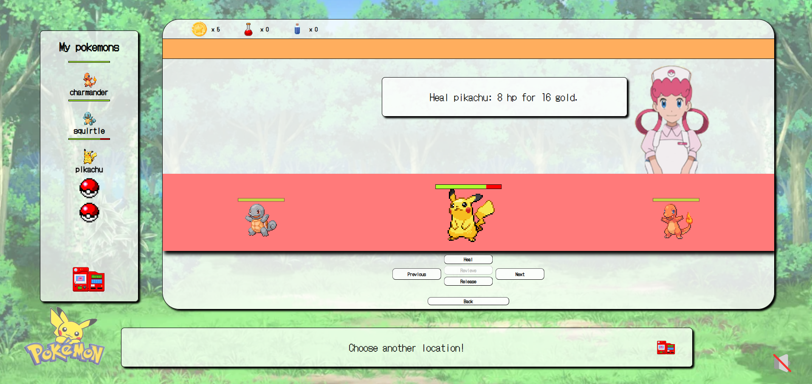
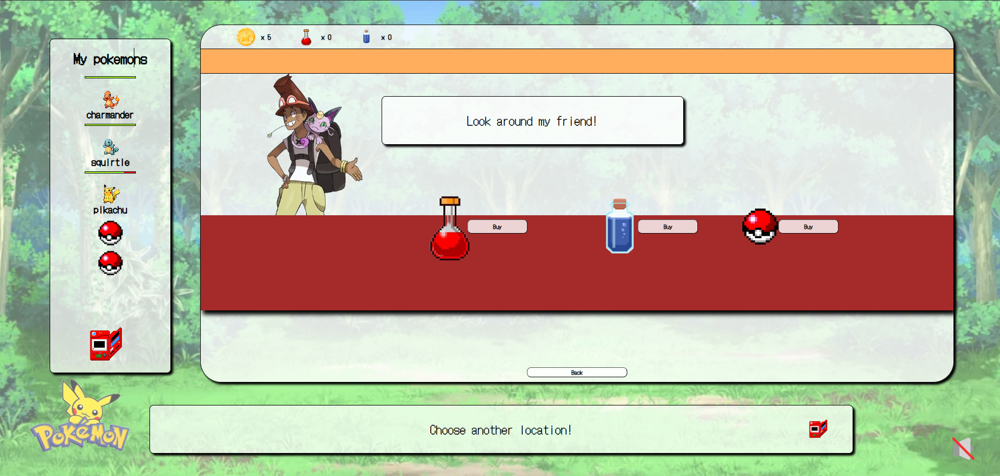
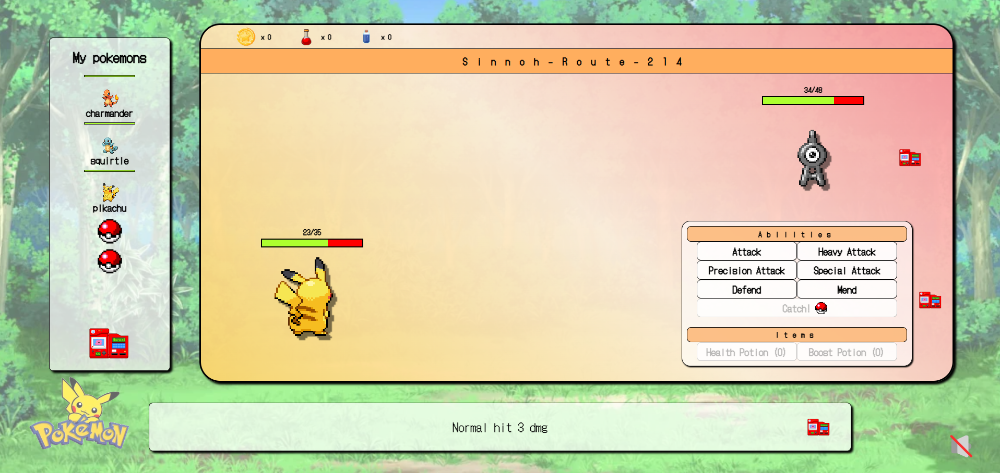

# Fetch Them All!

## Overview
**Fetch Them All!** is a Pokémon game developed purely in React without any third-party libraries. The game offers an immersive experience where players can explore a dynamically generated world, battle Pokémon, and build their ultimate team.

## Features
- **Choose Starter Pokémon** – Begin your adventure by selecting your first three Pokémons.
- **Explore an Auto-Generated Map** – Navigate a structured yet randomly populated world.
- **Engage in Battles** – Fight wild Pokémon and other trainers.
- **Use Skills & Potions** – Deploy different abilities and healing items to gain an edge.
- **Catch Pokémon** – Expand your team by capturing Pokémon encountered in the wild.
- **Visit Merchants & Medics** – Purchase items and heal your team.
- **Defeat Guardians** – Challenge powerful trainers guarding different areas.

## Screenshots
### Menu

### Map

### Medic

### Merchant

### Battle Scene

## Contribution
Contributions are welcome! If you'd like to contribute:
- Fork the repository.
- Create a new branch.
- Make your changes and submit a pull request.

## Deploy
- Try it out yourself!
- https://gele93.github.io/Poke-app/

*If you experience weird layouts please zoom out a little in your browser*
